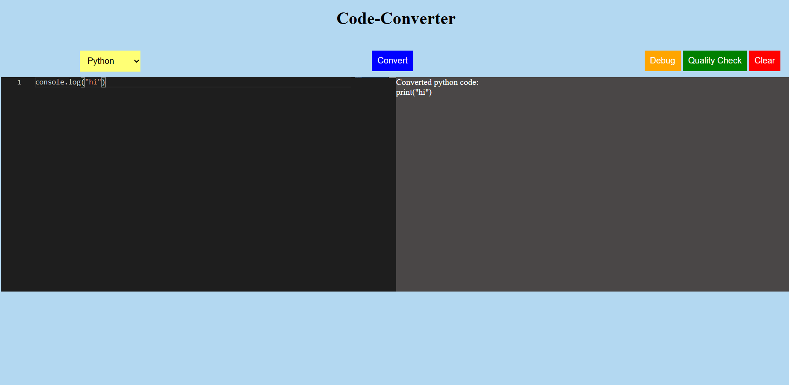
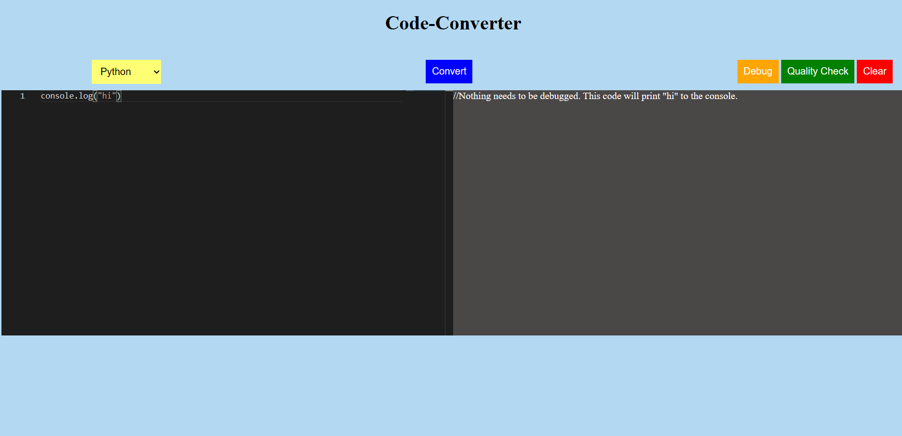
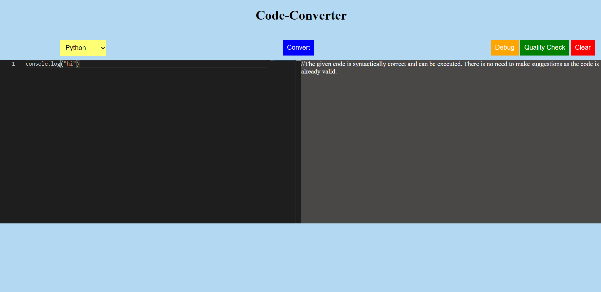

# Code_converter

It is code converter app where user can convert their code into different languages and also able to debug the code.

## 🛠 Tools

1. Html
2. Css
3. Javascript
4. NodeJs

## Features

1. User can convert their code
2. User can debug code
3. User can check quality of the code

#convert code

#debug code

#check quality of code

## Support

For support, email maneyogita2021@gmail.com
